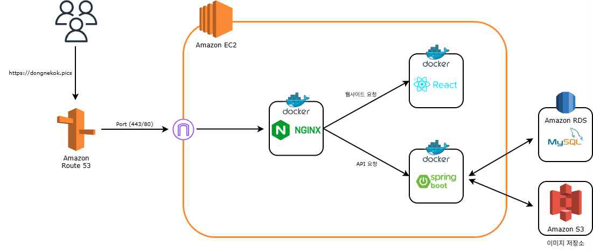

# 🛒 동네콕 (Dongne Kok) - GPS 기반 마감 임박 상품 거래 플랫폼

> **"지갑은 가볍게, 마음은 뿌듯하게!"**
> 우리 동네 마감 할인 상품을 실시간으로 찾고 거래하여 자원 낭비를 줄이는 하이퍼로컬 플랫폼

## 🔄 Project Status: Refactoring & Migration
> **"Legacy에서 Production Level로"**
> 이 저장소는 기존 팀 프로젝트(MVP 단계)에서 발생한 **스파게티 코드, 보안 취약점, 비효율적인 쿼리** 등을 개선하기 위해 처음부터 다시 설계 및 구현(Re-building)하고 있는 프로젝트입니다.
>
> **[핵심 개선 목표]**
> * 📉 **협업 프로세스 정립:** Issue & PR 템플릿 기반의 작업 관리
> * 🛡️ **보안 강화:** API Key 은닉화 및 Spring Security 구조 개선
> * ⚡ **성능 최적화:** N+1 문제 해결 및 인덱싱 적용
<br>

## 1. 프로젝트 소개 (Project Overview)
'동네콕'은 유통기한 임박 상품의 폐기를 줄이고, 소비자와 소상공인을 연결하는 GPS 기반 O2O(Online to Offline) 플랫폼입니다.
판매자는 폐기 비용을 절감하여 추가 수익을 창출하고, 소비자는 합리적인 가격에 상품을 구매할 수 있으며, 궁극적으로 환경 보호에 기여하는 선순환 구조를 목표로 합니다.

* **개발 기간:** 2024.03 ~ 2024.11 (약 9개월)
* **프로젝트 유형:** 2025학년도 캡스톤 디자인 졸업작품
* **팀 구성:** 3인 (풀스택 개발 및 인프라 구축)
* **배포 URL:** [AWS 배포 주소 또는 '현재 로컬 구동 중']

<br>

## 2. 기술 스택 (Tech Stack)
최신 기술 트렌드를 반영하여 안정적이고 확장 가능한 아키텍처를 구축했습니다.

| 분류 | 기술 스택 |
| --- | --- |
| **Frontend** | React (v18), JavaScript, Styled-components |
| **Backend** | Java 21, Spring Boot 3.2, Spring Security, JPA (Hibernate) |
| **Database** | MySQL 8.0, Redis (Optional) |
| **Infrastructure** | AWS (EC2, RDS, S3, Route53), Docker, Docker Compose, Nginx |
| **DevOps** | GitHub Actions (CI/CD), Gradle |
| **Tools** | IntelliJ IDEA, VS Code, Postman, Git |

<br>

## 3. 시스템 아키텍처 (System Architecture)
Nginx를 리버스 프록시로 두고, 프론트엔드와 백엔드를 Docker 컨테이너로 분리하여 마이크로서비스 형태의 배포 환경을 구축했습니다.


<br>

## 4. 담당 역할 및 기여도 (My Contributions)
**Role: 백엔드 & 프론트엔드 개발 (판매자 시스템 메인), 시스템 통합(System Integration)**

### 👨‍💻 Backend (Spring Boot)
* **판매자(Seller) 도메인 전담 개발:** 상품 등록(CRUD), 재고 관리, 유통기한 설정 로직 구현.
* **주문 관리 시스템 구현:** 실시간 예약 현황 및 판매 완료 내역을 관리하는 대시보드 API 개발.
* **QR코드 인증 로직 구현:** 구매자가 제시한 QR코드를 판매자가 스캔하여 트랜잭션을 안전하게 종료(Commit)하는 핵심 비즈니스 로직 설계.

### 🎨 Frontend (React)
* **판매자 센터(Seller Portal) UI/UX 구축:** 직관적인 대시보드와 상품 등록/관리 페이지 구현.
* **실시간 데이터 연동:** 판매 현황을 즉각적으로 확인할 수 있는 반응형 인터페이스 개발.

### ⚙️ DevOps & Infra (System Integration)
* **Docker 컨테이너 환경 구축:** `docker-compose`를 활용하여 Frontend, Backend, Nginx 컨테이너 오케스트레이션 구성.
* **Nginx 리버스 프록시 설정:** 단일 진입점(Port 443)에서 `/api` 요청과 정적 파일 요청을 라우팅하여 **CORS 문제 및 Mixed Content 보안 이슈 해결**.

<br>

## 5. 핵심 기능 (Key Features)

### 📍 구매자 (Buyer)
* **GPS 기반 상품 검색:** 사용자 위치 기준 반경 3km 내의 할인 상품을 지도와 리스트로 제공.
* **상품 예약 및 결제:** 앱 내 결제 후 QR코드 발급.
* **구매 이력 관리:** 실시간 예약 상태 확인 및 QR코드 조회.

### 🏪 판매자 (Seller)
* **상품 관리 대시보드:** 유통기한, 할인율, 재고를 간편하게 등록 및 수정.
* **QR 스캔 거래 완료:** 별도의 장비 없이 스마트폰 카메라로 QR코드를 스캔하여 즉시 판매 처리.
* **매출/주문 현황:** 실시간으로 들어오는 주문(체크인 대기)과 판매 완료 내역 확인.

<br>

## 6. 트러블 슈팅 (Troubleshooting)
### 🚀 개발/배포 환경 불일치로 인한 CORS 및 라우팅 문제 해결
* **문제 상황:** 로컬(`localhost`)에서는 정상 작동하던 API가 AWS 배포 환경(`dongnekok.pics`)에서 502 Bad Gateway 및 CORS 에러 발생. 소셜 로그인 리다이렉트 URI 불일치 문제 확인.
* **원인 분석:** 프론트엔드와 백엔드가 서로 다른 도메인/포트를 사용함에 따른 브라우저 보안 정책 위반 및 Nginx 설정 미숙.
* **해결 방법:**
    1.  **Nginx Reverse Proxy 도입:** 클라이언트의 모든 요청을 Nginx(80/443)가 받아 `/api` 경로는 백엔드 컨테이너(8080)로, 그 외는 리액트 정적 파일(80)로 내부 라우팅 처리.
    2.  **Docker Network 구성:** 3개의 컨테이너(Front, Back, Nginx)를 하나의 도커 네트워크로 묶어 내부 통신 안정화.
    3.  **결과:** CORS 설정 없이도 Same-Origin 정책을 준수하게 되어 보안성과 통신 안정성 확보.

<br>

## 7. ERD (Entity Relationship Diagram)
효율적인 데이터 관리를 위해 정규화된 데이터베이스 설계를 수행했습니다.


<br>

## 8. 설치 및 실행 방법 (How to Run)
이 프로젝트는 Docker 환경에서 가장 쉽게 실행할 수 있습니다.

```bash
# 1. 저장소 복제
git clone [https://github.com/maenggyuno/timedeal-platform.git](https://github.com/maenggyuno/timedeal-platform.git)

# 2. 프로젝트 폴더로 이동
cd timedeal-platform

# 3. 환경 변수 설정 (backend/src/main/resources/application.yml)
# DB 설정 및 OAuth 키 설정 필요

# 4. Frontend 의존성 설치 및 실행
cd frontend
npm install
npm start

# 5. Backend 실행 (IntelliJ 또는 Gradle)
cd backend
./gradlew bootRun
